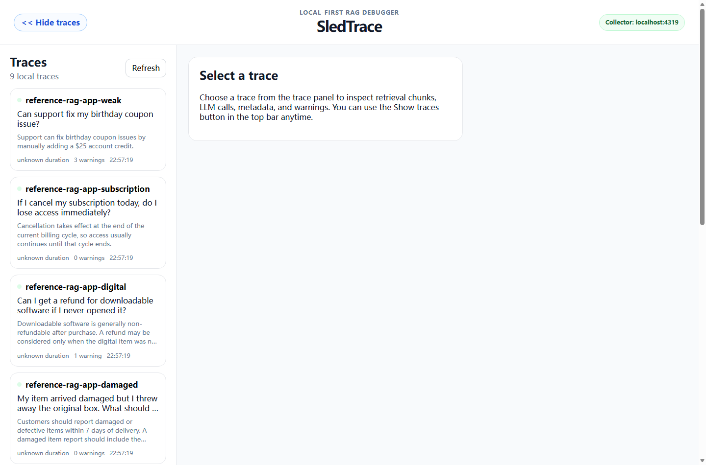
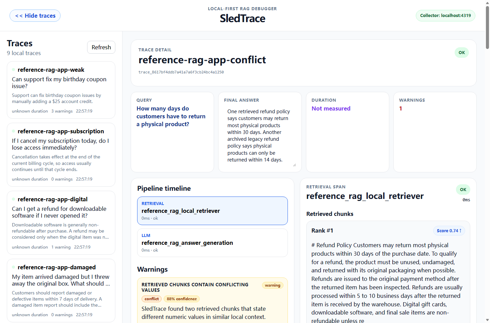
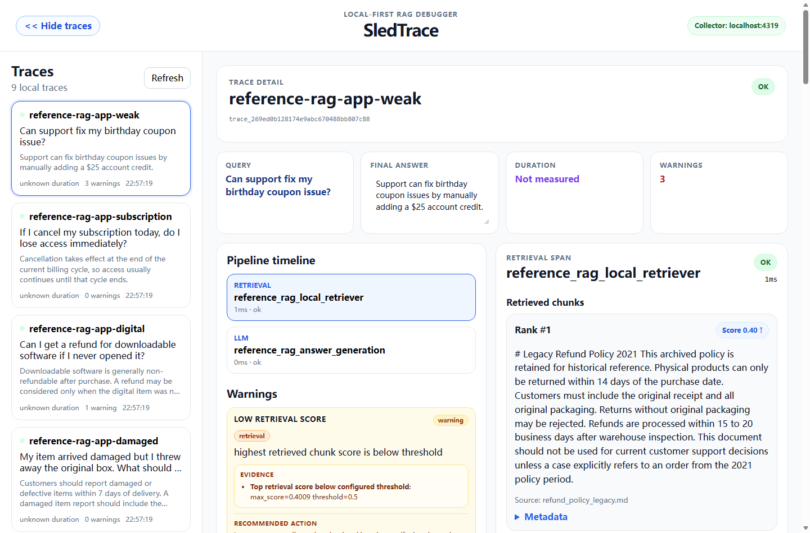

# SledTrace

SledTrace is an open-source, local-first observability and debugging tool for RAG pipelines.

It helps developers inspect why a RAG application produced a bad answer by showing the full pipeline: retrieved chunks, retrieval scores, prompts, responses, and diagnostic warnings.

SledTrace is designed for local development first. The default local demo is deterministic, API-key free, and runs entirely on your machine.

Latest release: [SledTrace v0.6.0 — Local CLI / Startup UX](https://github.com/Schromeo/SledTrace/releases/tag/v0.6.0)

Distribution status: the Python SDK can be installed from source or a locally built wheel. SledTrace is not published to PyPI yet, so `pip install sledtrace` is not currently a supported installation path.

#### Why "SledTrace"?

Named after my husky. Running a RAG pipeline is like pulling a sled: many components - retrievers, rerankers, LLMs - pulling together like a dog team, and when the sled goes off course, you need to read the tracks in the snow to figure out which dog stumbled. SledTrace shows you the tracks.

## Why SledTrace?

RAG applications often fail silently.

A wrong answer may come from:

* no retrieved context
* weak retrieval scores
* duplicated chunks
* conflicting retrieved evidence
* stale or legacy documents
* an answer that is not grounded in retrieved context
* the model ignoring useful context

SledTrace makes these failure modes visible so developers can debug the pipeline instead of guessing what went wrong.

## Screenshots

### Trace overview

SledTrace shows local RAG traces with warning counts and demo case labels.



### Conflicting retrieved context

SledTrace can surface conflicting retrieved chunks, such as legacy and current refund policies that disagree.



### Answer not grounded in retrieved context

SledTrace can flag answers that introduce unsupported claims even when retrieval found relevant context.



## What SledTrace shows

The current local MVP supports:

* Python SDK tracing
* retrieval span logging
* LLM span logging
* local Go collector
* SQLite persistence
* React dashboard
* trace list
* trace detail view
* retrieved chunks viewer
* LLM prompt / response viewer
* evidence-backed warning cards
* diagnostic signals, evidence items, and recommended actions
* numeric value comparison blocks for grounding diagnostics

Current implemented span types:

* `retrieval`
* `llm`

Current warning rules:

* `no_retrieved_chunks`
* `low_retrieval_score`
* `duplicate_chunks`
* `weak_query_chunk_overlap`
* `numeric_mismatch`
* `conflicting_chunks`
* `answer_not_grounded`

The current warning rules are intentionally deterministic and local-first. SledTrace does not use LLM-as-judge by default.

See `docs/demo/WARNING_RULES.md` for current rule definitions and limitations.

## Quickstart

### Path A: Docker Compose local stack (recommended)

Use this path when you are fresh-cloning the repo and want the fastest first run.

```bash
docker compose up --build
```

In another terminal, verify collector health:

```bash
curl http://localhost:4319/health
```

Then generate reference traces:

```bash
cd sdk/python
pip install -e .
python -m examples.reference_rag_app.run all
```

Open:

```text
http://localhost:5173
```

### SDK packaging milestone (v0.5.0)

This release completed the Python SDK packaging readiness work for local distribution without publishing to PyPI.

```bash
cd sdk/python
pip install -e .

python -m pip install --upgrade pip
python -m pip install build
python -m build
pip install dist/*.whl
```

New code should use the SledTrace import path:

```python
from sledtrace import trace
```

Legacy `raglens` compatibility remains temporary for migration support, but the project is now SledTrace-first.

PyPI publishing is not part of v0.5.0 unless a later release decides to publish manually.

### CLI milestone (v0.6.0)

The released v0.6.0 local developer startup flow has a small installable CLI entry point.

```bash
cd sdk/python
pip install -e .

sledtrace --help
sledtrace version
sledtrace serve
```

`serve` delegates to the existing repo-local startup script so the collector and dashboard launch in the same way as the current local workflow.

`sledtrace serve` is a source-checkout command in v0.6.0. Run it from the repository root or any directory inside the checkout. A normal wheel installation still supports `sledtrace --help` and `sledtrace version`, but it does not bundle the collector, dashboard, Docker assets, or a standalone serving runtime. Outside a checkout, `serve` exits with guidance instead of guessing a repository path.

See the [v0.6.0 GitHub Release](https://github.com/Schromeo/SledTrace/releases/tag/v0.6.0) for the completed release scope and validation record.

Current recommended local stack:

```bash
docker compose up --build
```

### Path B: Repo-local startup helper (fallback)

Use this path when you do not want Docker.

From the repo root:

```bash
python scripts/start-sledtrace.py
```

Then run traces in another terminal:

```bash
cd sdk/python
python -m examples.reference_rag_app.run all
```

Manual fallback startup (non-Docker):

```bash
cd collector/go
go run ./cmd/sledtrace-collector

cd dashboard/web
npm install
npm run dev
```

### Path C: Use SledTrace with your own RAG app

Use this path when you want to instrument an existing Python RAG application instead of using only the built-in demo.

1. Clone SledTrace somewhere locally.

2. From the SledTrace repo root, start local services:

```bash
python scripts/start-sledtrace.py
```

3. In your own app virtual environment, install the SDK from the local checkout:

```bash
pip install -e /path/to/sledtrace/sdk/python
```

4. Instrument your own request path with the Python SDK:

```python
from sledtrace import trace


def answer_question(user_query: str) -> str:
    with trace(name="my-rag-request", query=user_query) as t:
        retrieved = my_retriever(user_query)
        chunks = to_sledtrace_chunks(retrieved)

        t.retrieval(
            query=user_query,
            chunks=chunks,
            name="primary_retrieval",
            top_k=len(chunks),
        )

        prompt = build_prompt(user_query, chunks)
        answer = my_answerer(prompt)

        t.llm(
            model="my-model-name",
            prompt=prompt,
            response=answer,
            name="answer_generation",
            provider="local",
        )

    t.flush()
    return answer
```

`to_sledtrace_chunks(...)` represents your app-owned adapter from retriever-native results to SledTrace chunk dictionaries.

A minimal chunk shape looks like this:

```python
{
    "id": "chunk_1",
    "text": "Customers may return most physical products within 30 days.",
    "score": 0.92,
    "metadata": {
        "source": "refund_policy.md"
    }
}
```

Current implemented span types are `retrieval` and `llm` only.

For practical integration details, see:

* `docs/product/USER_ONBOARDING.md`
* `docs/integrations/PYTHON_SDK_GUIDE.md`
* `sdk/python/examples/custom_pipeline_demo.py`

## Local RAG demo

The local demo is deterministic and API-key free.

```bash
cd sdk/python
python -m examples.local_rag_demo.run_demo trace-all
```

Useful docs:

* `docs/demo/LOCAL_RAG_DEMO.md`
* `docs/demo/SMOKE_TEST.md`
* `docs/demo/WARNING_RULES.md`

## Diagnostic quality reference app

This is the recommended validation app for v0.4 first-run checks.

```bash
cd sdk/python
python -m examples.reference_rag_app.run all
```

Expected traces:

* `reference-rag-app-refund`
* `reference-rag-app-conflict`
* `reference-rag-app-wrong-window`
* `reference-rag-app-processing-range`
* `reference-rag-app-wrong-processing-range`
* `reference-rag-app-damaged`
* `reference-rag-app-digital`
* `reference-rag-app-subscription`
* `reference-rag-app-weak`

For full run guide, see `docs/demo/REFERENCE_RAG_APP.md`.

## Optional real LLM validation

The default demos do not require an API key.

```bash
cd sdk/python
python -m examples.real_llm_rag_demo all
```

## Windows PowerShell shortcuts

You can also use the provided PowerShell scripts from the repository root.

One-click start:

```powershell
python .\scripts\start-sledtrace.py
```

Start the collector:

```powershell
.\scripts\windows\start-collector.ps1
```

Start the dashboard in another terminal:

```powershell
.\scripts\windows\start-dashboard.ps1
```

Generate demo traces in a third terminal:

```powershell
.\scripts\windows\demo-trace-all.ps1
```

Run the smoke test:

```powershell
.\scripts\windows\smoke.ps1
```

## macOS shortcuts

On macOS, use the shell scripts in `scripts/mac`.

One-click start:

```bash
python ./scripts/start-sledtrace.py
```

Start the collector:

```bash
bash ./scripts/mac/start-collector.sh
```

Start the dashboard in another terminal:

```bash
bash ./scripts/mac/start-dashboard.sh
```

Generate demo traces in a third terminal:

```bash
bash ./scripts/mac/demo-trace-all.sh
```

Run the smoke test:

```bash
bash ./scripts/mac/smoke.sh
```

## Documentation

### For users

* `docs/product/USER_ONBOARDING.md` - Integrate SledTrace into an existing RAG app.
* `docs/integrations/PYTHON_SDK_GUIDE.md` - Python SDK API usage.
* `docs/demo/LOCAL_RAG_DEMO.md` - Deterministic local demo flow.
* `docs/demo/REFERENCE_RAG_APP.md` - Reference integration runbook.
* `docs/demo/SMOKE_TEST.md` - End-to-end smoke test flow.
* `docs/demo/WARNING_RULES.md` - Current warning rules and limitations.
* `docs/releases/V0_4_0.md` - v0.4.0 release notes (originally released under the RAGLens name).
* `docs/releases/V0_4_1.md` - SledTrace v0.4.1 rebrand release notes.
* `docs/releases/V0_5_0.md` - Python SDK distribution and packaging-readiness release notes.
* `docs/releases/V0_6_0.md` - Local CLI and startup UX release notes.
* `docs/REBRANDING.md` - migration notes for the RAGLens to SledTrace rename.

### For contributors / maintainers

* `docs/ai-context/ROADMAP.md` - Milestones and planned sequencing.
* `docs/ai-context/DEVLOG.md` - Chronological implementation log.
* `docs/ai-context/CURRENT_TASK.md` - Current focus and immediate next steps.
* `docs/architecture/TRACE_DATA_MODEL.md` - Trace and span schema reference.
* `docs/ai-context/AI_HANDOFF.md` - Latest handoff status and context.
* `docs/product/V0_3_DIAGNOSTIC_INTELLIGENCE.md` - Diagnostic intelligence design notes.

## Current status

Milestone snapshot:

* v0.1 local RAG debugger MVP: complete
* v0.2 developer integration / local SDK onboarding: complete
* v0.3 diagnostic intelligence core: complete
* v0.3.5 deterministic diagnostic-quality hardening: complete
* v0.4.0 Docker/local first-run release: complete
* v0.4.1 rebrand release: complete
* v0.5.0 Python SDK distribution / packaging readiness: complete
* v0.6.0 local CLI / startup UX: complete

Published releases:

* [v0.5.0 — Python SDK Packaging Readiness](https://github.com/Schromeo/SledTrace/releases/tag/v0.5.0)
* [v0.6.0 — Local CLI / Startup UX](https://github.com/Schromeo/SledTrace/releases/tag/v0.6.0)

Current version:

```text
v0.6.0 - Local CLI / Startup UX
```

Completed:

* Python SDK tracing foundation
* Go collector ingestion APIs
* SQLite trace/span/warning persistence
* React dashboard MVP
* Warning Engine / Diagnosis Layer MVP
* Real Local RAG Demo using local markdown docs, TF-IDF retrieval, cosine similarity, and a deterministic local answerer
* Developer Integration / Local SDK Onboarding
* User onboarding documentation
* Python SDK guide
* Custom pipeline integration example
* Cross-platform repo-local startup helper
* Warning Schema v2
* Evidence-backed warning details
* Diagnostic signals, evidence items, and diagnostic objects
* Dashboard warning detail rendering with evidence previews, numeric value diffs, and recommended actions
* Deterministic diagnostic hardening for:

  * natural-language numeric ranges such as `5 to 10 business days`
  * elapsed-time false-positive protection such as `20 days ago`
  * relevance-aware conflicting chunk selection
  * topic-gated conflicting chunk selection
  * query-intent compatibility for conflict warnings
* Thin reference RAG app with mixed retrieval output normalization
* Optional real LLM validation demo
* Docker Compose local stack for collector + dashboard
* root `.env.example` and Docker reset guidance
* v0.4 release notes and first-run docs cleanup
* locally buildable Python wheel and sdist
* installable `sledtrace` console script with help and version commands
* source-checkout-aware `sledtrace serve` delegation

The default demo requires no external LLM API and no API key.

## Current limitations

Current scope limits:

* only `retrieval` and `llm` spans are implemented
* onboarding path is local-first and repo-based
* the SDK is distributed from source or local wheel artifacts; it is not published to PyPI
* `sledtrace serve` requires a SledTrace source checkout and is not a standalone wheel-installed runtime
* no LangChain adapter yet
* no LlamaIndex adapter yet
* no cloud sync, auth, hosted collector, or hosted features
* no full LLM-as-judge grounding evaluator
* no running-trace lifecycle handling for multi-step agent harnesses
* no partial span ingestion
* no retry spans
* no diagnostics for agent loops, oscillation, retry storms, or no-progress execution

## Project direction

SledTrace starts as a local-first visual debugger for RAG pipelines.

SledTrace starts with RAG pipeline debugging because retrieval, context quality, conflicting evidence, and grounding are common failure points in AI applications.

The longer-term direction is to evolve the tracing core into a local-first observability layer for AI application harnesses: systems that manage context, tools, memory, model calls, verification, and feedback around foundation models.

In that direction, SledTrace can grow beyond retrieval and LLM spans toward tool spans, memory spans, verification spans, human feedback spans, and richer diagnostics over AI application traces. Those remain future direction only and are not implemented in the current SDK.

Future agent harness observability may also include running traces across multi-step executions, partial span ingestion, additional span types such as agent, tool, and retry spans, plus diagnostics for agent loops, oscillation, retry storms, and no-progress execution. These are not implemented in current SledTrace.

Near-term focus:

* v0.7.0 External Developer Readiness
* automated CI for the Python SDK, Go Collector, and Dashboard
* clean-clone first-run validation with user-visible evidence
* contributor entry points and a small evidence-backed public issue backlog
* an explicit PyPI publication decision and repeatable publishing plan
* preserve deterministic-first warning generation and stable trace contracts

PyPI publishing is a high-priority v0.7 decision gate, not a shipped capability. Framework integrations and hosted/cloud features remain future candidates and are not part of the current implemented scope.

## Design principles

SledTrace follows a few core principles:

* local-first by default
* deterministic demo path
* no API key required for the default local demo
* explain RAG failures instead of only displaying raw traces
* make retrieved evidence, prompts, responses, and warnings inspectable
* keep warning rules simple, explicit, evidence-backed, and documented
* preserve current trace contracts while improving developer experience


