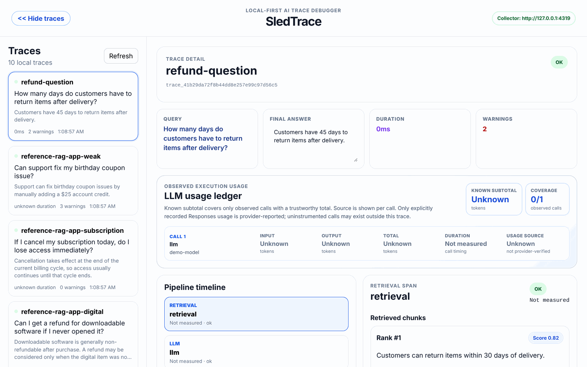
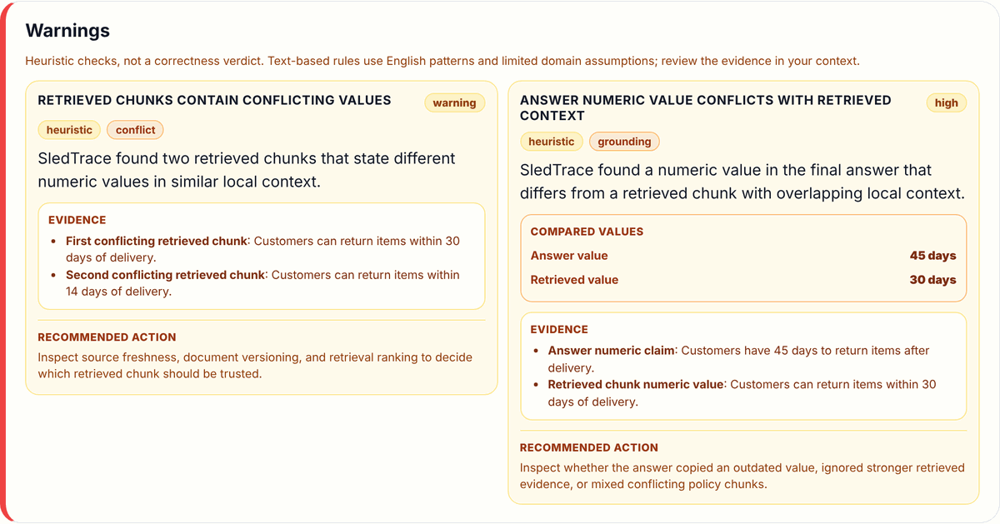

# SledTrace

[](https://github.com/Schromeo/SledTrace/actions/workflows/ci.yml)
[](https://pypi.org/project/sledtrace/)

**A local debugger for RAG pipelines.** When your app gives a wrong answer,
SledTrace shows you why: what the retriever returned, what the model was given,
what it said, and where those disagree.

Everything runs on your machine. No account, no API key, nothing uploaded.



## Quickstart

```bash
pip install sledtrace
sledtrace serve
```

Your browser opens the dashboard at `http://127.0.0.1:4319`. Now send it a
trace. Save this as `first_trace.py` and run it in another terminal:

```python
from sledtrace import trace

question = "How many days do customers have to return items after delivery?"

with trace(name="refund-question", query=question) as t:
    t.retrieval(
        query=question,
        chunks=[
            {"id": "policy-2024", "text": "Customers can return items within 30 days of delivery.",
             "score": 0.82, "metadata": {"source": "refund_policy.md"}},
            {"id": "policy-2021", "text": "Customers can return items within 14 days of delivery.",
             "score": 0.79, "metadata": {"source": "legacy_refund_policy.md"}},
        ],
    )
    t.llm(model="demo-model", prompt=question,
          response="Customers have 45 days to return items after delivery.")

print(t.flush())
```

Refresh the dashboard and open **refund-question**. SledTrace points out that
the two retrieved policies contradict each other, and that the answer's
"45 days" isn't supported by either of them:



Ready to trace your own app? Follow the
**[5-minute quickstart](docs/QUICKSTART.md)**.

## What it catches

| Warning | Meaning |
| --- | --- |
| `no_retrieved_chunks` | The retriever returned nothing usable |
| `low_retrieval_score` | Even the best chunk scored low |
| `duplicate_chunks` | The same text was retrieved more than once |
| `weak_query_chunk_overlap` | Top chunks barely mention the question's key terms |
| `conflicting_chunks` | Retrieved chunks disagree with each other |
| `numeric_mismatch` | A number in the answer contradicts the retrieved context |
| `answer_not_grounded` | A claim in the answer is weakly supported by the context |

Every warning shows the evidence behind it and what to check next. The rules
are deterministic heuristics that run locally; no LLM judges your data. See
[warning rules](docs/demo/WARNING_RULES.md) for how each one works and where it
falls short.

SledTrace also records tool calls, the final task result, timing, and LLM token
usage. Values it doesn't know are shown as unknown, never as zero.

## How it works

```text
your Python app ──(sledtrace SDK)──▶ local collector ──▶ SQLite
                                        │
                                        └──▶ dashboard in your browser
```

You add a few calls to your request path (`trace`, `retrieval`, `llm`). The SDK
sends each finished trace to the collector that `sledtrace serve` starts; the
collector runs the warning rules and stores everything in
`~/.sledtrace/sledtrace.db`.

## Limits

- Python only, with explicit calls: there are no automatic LangChain or
  LlamaIndex integrations yet.
- Warnings are heuristics built on English text patterns, not a correctness
  verdict.
- Token usage is recorded only when you pass it (for example with
  `sledtrace.openai.record_response`); cost estimates are indicative.
- Local, single-user tool: no hosting, authentication or team features.
- Prebuilt `sledtrace serve` for Windows, macOS and Linux (x86-64 and ARM64).
  On other platforms, [run from source](docs/DEVELOPMENT.md).

## Documentation

- [Quickstart](docs/QUICKSTART.md): instrument your own RAG app.
- [Python SDK guide](docs/integrations/PYTHON_SDK_GUIDE.md): full API reference.
- [Warning rules](docs/demo/WARNING_RULES.md): what each warning checks.
- [Development setup](docs/DEVELOPMENT.md): run from source, Docker, demos, configuration.
- [Contributing](CONTRIBUTING.md) and [release notes](docs/releases/).
- [Renaming from RAGLens](docs/REBRANDING.md): `raglens` imports still work.

## Why "SledTrace"?

Named after my husky. A RAG pipeline is like a sled team: retrievers, rerankers
and LLMs all pulling together. When the sled goes off course, you read the
tracks in the snow to find out which dog stumbled. SledTrace shows you the
tracks.

## License

[MIT](LICENSE)
