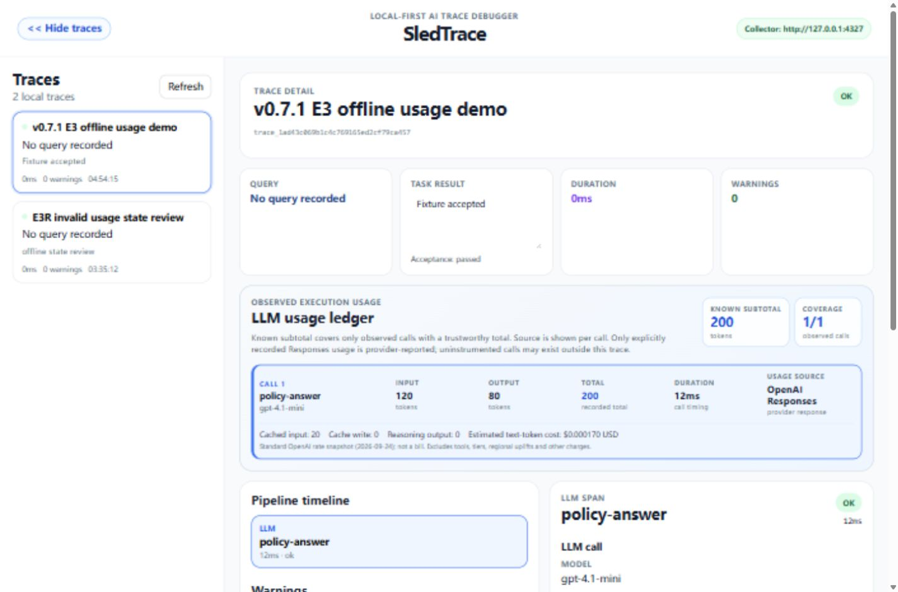

# Quickstart: trace your own RAG app in 5 minutes

This guide takes you from nothing to a traced request from your own Python RAG
code. You need Python 3.9 or newer. No API key, Docker, Go or Node.js is needed.

## 1. Install and start SledTrace

Install the SDK into the same virtual environment as your app:

```bash
pip install sledtrace
```

Start the local collector and dashboard (any terminal, any directory):

```bash
sledtrace serve
```

Your browser opens `http://127.0.0.1:4319`. Leave this terminal running and
press Ctrl+C when you are done. Traces are kept in `~/.sledtrace/sledtrace.db`,
so they are still there next time.

> `sledtrace serve --help` lists `--port`, `--db` and `--no-browser`. If you
> change the port, point your app at it with
> `SLEDTRACE_COLLECTOR_URL=http://127.0.0.1:<port>`.

## 2. Send a first trace

Save this as `first_trace.py` and run it with `python first_trace.py`:

```python
from sledtrace import trace

question = "How many days do customers have to return items after delivery?"

with trace(name="refund-question", query=question) as t:
    t.retrieval(
        query=question,
        chunks=[
            {"id": "policy-2024", "text": "Customers can return items within 30 days of delivery.",
             "score": 0.82, "metadata": {"source": "refund_policy.md"}},
            {"id": "policy-2021", "text": "Customers can return items within 14 days of delivery.",
             "score": 0.79, "metadata": {"source": "legacy_refund_policy.md"}},
        ],
    )
    t.llm(model="demo-model", prompt=question,
          response="Customers have 45 days to return items after delivery.")

print(t.flush())
```

Refresh the dashboard and open **refund-question**. SledTrace flags two
problems:

- **Conflicting chunks** — the current and the legacy policy disagree
  (30 vs 14 days), so the retriever handed the model contradictory context.
- **Numeric mismatch** — the answer says 45 days, which no retrieved chunk
  supports.

Each warning shows the evidence it is based on and what to check next.

## 3. Trace your own request

Wrap one request in `trace()`, record what your retriever returned and what the
model said, then flush after the `with` block:

```python
from sledtrace import trace


def answer_question(question: str) -> str:
    with trace(name="support-answer", query=question) as t:
        with t.measure() as retrieval_timing:
            results = my_retriever.search(question, k=4)      # your code

        t.retrieval(
            query=question,
            chunks=[to_chunk(r) for r in results],
            top_k=4,
            timing=retrieval_timing,
        )

        prompt = build_prompt(question, results)              # your code
        with t.measure() as llm_timing:
            answer = my_llm(prompt)                           # your code

        t.llm(model="gpt-4.1-mini", prompt=prompt, response=answer, timing=llm_timing)

    delivery = t.try_flush()        # never breaks your request
    if not delivery.ok:
        print(f"SledTrace delivery failed: {delivery.error!r}")
    return answer
```

`to_chunk` is a small adapter you write for your retriever's result type. Each
chunk is a plain dict; `text` is required, the rest makes the warnings better:

```python
def to_chunk(result) -> dict:
    return {
        "id": result.id,
        "text": result.text,
        "score": result.score,
        "score_type": "similarity",            # or "distance"
        "score_direction": "higher_is_better",  # or "lower_is_better"
        "metadata": {"source": result.source},
    }
```

If your retriever returns distances or tuples, `sledtrace.normalize_chunk(...)`
keeps the score's meaning instead of guessing. See
[score semantics](integrations/PYTHON_SDK_GUIDE.md#retrieval-score-semantics).

Things to know:

- Call `t.flush()` or `t.try_flush()` **after** the `with` block, so the trace
  is complete. `flush()` raises on failure; `try_flush()` returns a result.
- `t.measure()` records real durations. Without it, durations show as
  "Not measured" rather than a misleading 0 ms.
- Exceptions inside the `with` block are recorded on the trace and re-raised.

## 4. Optional extras

**Tool calls and the final result.** If your pipeline calls tools, or you want
to record what was finally returned and whether it was accepted:

```python
# inside the `with trace(...) as t:` block
t.tool("lookup_order", input_summary="order 1234", output_summary="shipped")
t.log_task_result(answer, accepted=True)
```

**OpenAI token usage.** For a non-streaming Responses API call, copy the
provider-reported usage onto the trace:

```python
from sledtrace.openai import record_response

# inside the `with trace(...) as t:` block
response = client.responses.create(model="gpt-4.1-mini", input=prompt)
record_response(t, response)
```

The dashboard's usage ledger then shows input/output tokens and an indicative
text-token cost for supported models. Unknown values stay "Unknown", never 0.



## What SledTrace checks

| Warning | Meaning |
| --- | --- |
| `no_retrieved_chunks` | The retriever returned nothing usable |
| `low_retrieval_score` | Even the best chunk scored low |
| `duplicate_chunks` | The same text was retrieved more than once |
| `weak_query_chunk_overlap` | Top chunks barely mention the question's key terms |
| `conflicting_chunks` | Retrieved chunks disagree with each other |
| `numeric_mismatch` | A number in the answer contradicts the retrieved context |
| `answer_not_grounded` | A claim in the answer is weakly supported by the context |

The rules are deterministic and run locally; no LLM judges your data.
Details and known limits: [warning rules](demo/WARNING_RULES.md).

## Troubleshooting

- **Nothing shows up** — is `sledtrace serve` still running? Check
  `http://127.0.0.1:4319/health`, and make sure you called `flush()` /
  `try_flush()` after the `with` block.
- **`ConnectionRefusedError` from `flush()`** — the collector is not running or
  is on another port; set `SLEDTRACE_COLLECTOR_URL`.
- **"does not include the bundled collector"** — there is no prebuilt wheel for
  your platform. Run SledTrace from source instead: see
  [development setup](DEVELOPMENT.md).
- **Port 4319 is busy** — `sledtrace serve --port 4320` and set
  `SLEDTRACE_COLLECTOR_URL=http://127.0.0.1:4320` for your app.

## Next steps

- [Python SDK guide](integrations/PYTHON_SDK_GUIDE.md) — full API, chunk shape,
  timing and flush behaviour.
- [Example trace](demo/comprehensive_trace_example.json) — a complete trace as
  JSON, covering all seven warning types.
- [Development setup](DEVELOPMENT.md) — run from source, Docker, demos.
