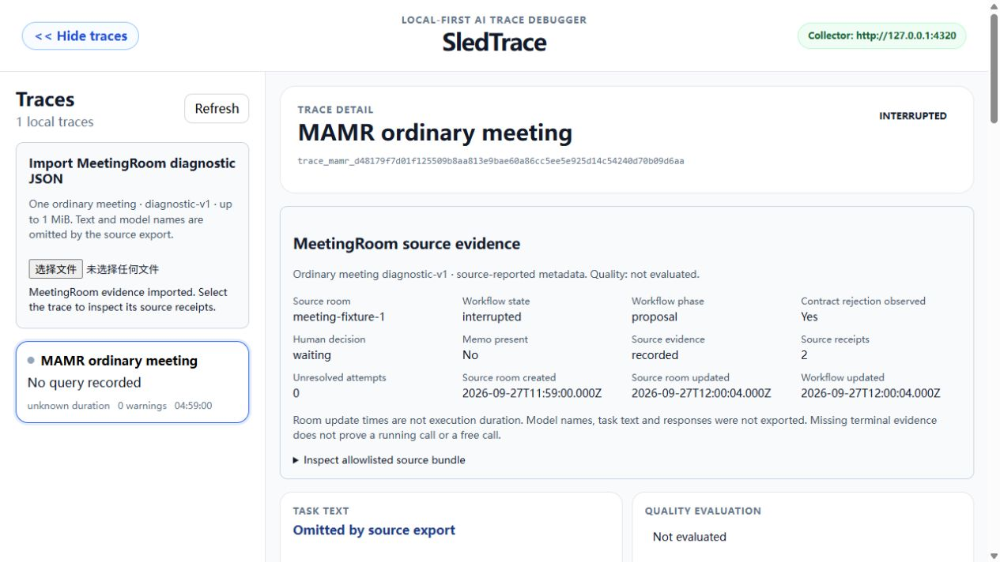
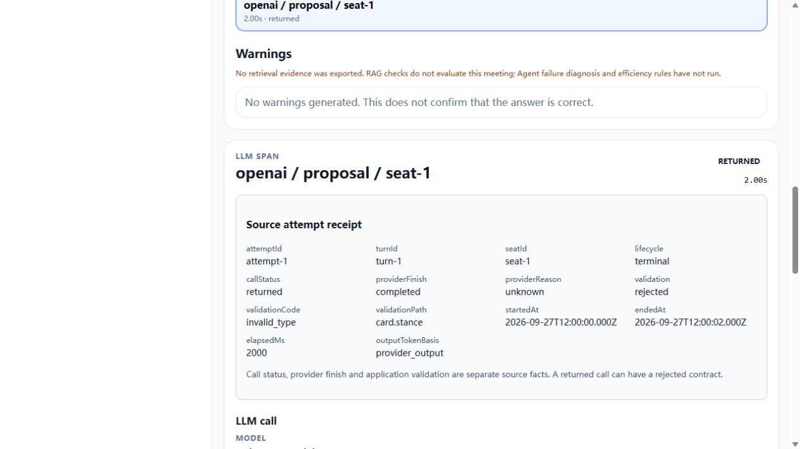
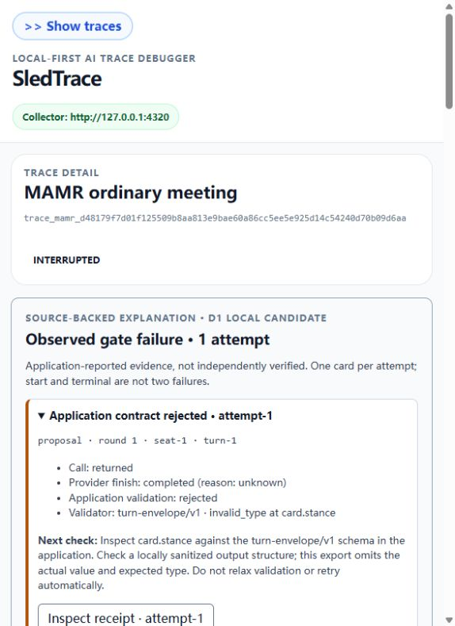
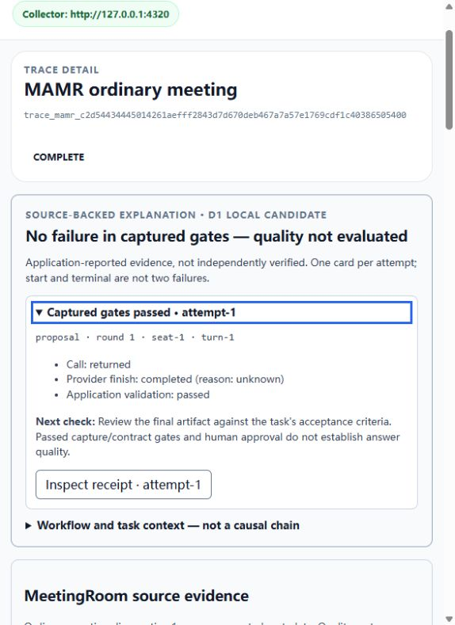
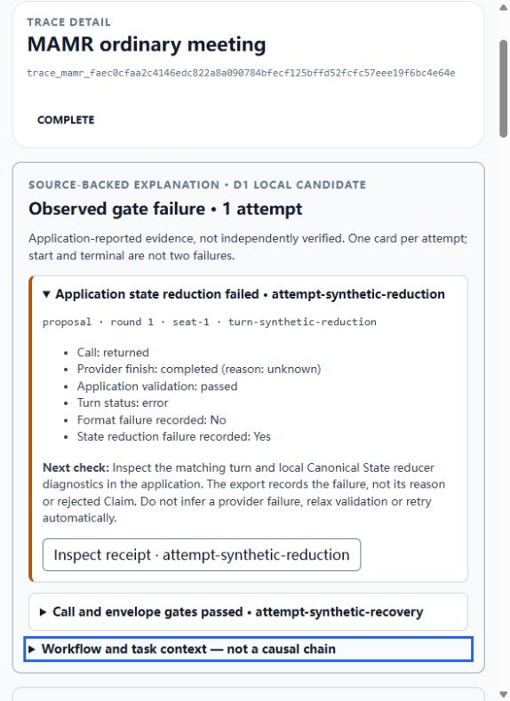

# MeetingRoom diagnostic-v1 import — local development candidate

Updated 2026-09-29. Available in this development checkout, not the published
0.7.1 wheel. Imports one ordinary Decide meeting's metadata-only export into
the local Collector and Dashboard. P4 also derives a bounded D1 gate explanation
from source facts. Causal impact chains are not implemented. The separate local
[paired view](PAIR_EVIDENCE.md) uses user-declared controls and quality; MAMR v1
does not supply controlled-comparison metadata.

## Use

Start this checkout's Collector and Dashboard. In MeetingRoom, export the selected
saved ordinary meeting's diagnostic JSON. In SledTrace's trace sidebar choose
**Import MeetingRoom diagnostic JSON**, then select that file. The imported trace
opens automatically. The source panel shows workflow/task facts; a selected
attempt shows provider and validator facts separately. The expandable bundle
shows the exact accepted projection.

Only ordinary diagnostic-v1 is supported. Plan, Review, Observer and Solo
exports, full room records, arbitrary third-party trace formats and model text
are not supported. Model names were deliberately omitted by the source, so
model and price remain unknown. Human approval is not a quality score.

## Endpoint and validation

`POST /api/imports/mamr`, `Content-Type: application/json`.

- 1 MiB maximum request body; one root object; at most 1024 items per array.
- All declared fields required, with exact case-sensitive names/types. Explicit
  null is allowed only in nullable source fields. Empty lists must be `[]`.
  Unknown keys, duplicate keys, trailing documents and deep nesting are rejected.
- `schemaVersion=1`, `kind=mamr-ordinary-meeting-diagnostic`. Root fields:
  `schemaVersion`, `kind`, `room`, `workflow`, `taskResult`, `outcomeSignals`,
  `turns`, `sourceEvidence`. Nested field names are exactly those in the
  [three source-generated examples](../../collector/go/internal/mamr/testdata).
  The importer types in `internal/mamr/import.go` own the executable contract.
- IDs use `[a-zA-Z0-9._:/-]`, with bounds matching the source (room 200,
  attempt/request 80, turn 300, seat 120). Providers are openai/anthropic/gemini.
  Counts and their aggregate must fit a nonnegative JavaScript safe integer;
  count.source is reported only with a value, otherwise unknown/null.
  Round is 1–100; outputLimit is 1–100000. Dates require RFC3339, at most 32
  characters, and room/attempt end must not precede start. Monotonic elapsed
  is source-reported, not recomputed from wall-clock subtraction.
- Each receipt references an exported turn with matching seat/round/phase.
  At most one start and one terminal per attempt; paired identity must match;
  terminal-before-start and duplicate receipts/turns are rejected. Terminal-only
  evidence is supported. Unresolved IDs must exactly match starts lacking terminals.
- not_recorded/recorded_empty require no receipts; recorded requires receipts.
  Rejection-observed, meeting-interrupted and duplicated human/quality signals
  must match the explicit source facts. No terminal means rejection unknown.
  Validator codes/paths use the source's fixed allowlist; arbitrary errors are
  not accepted. Quality remains `not_evaluated`.

| Response | Meaning |
| --- | --- |
| 201 `{trace_id,status:"imported"}` | New immutable source snapshot stored atomically |
| 200 `{trace_id,status:"unchanged"}` | Same mapped source content; no new records/calls |
| 400 | Invalid/unsupported or contradictory bundle; nothing stored |
| 409 | Same source room already has different content; original kept |
| 413 | More than 1 MiB |
| 415 | Content type is not JSON |
| 500 | Storage failed; transaction rolled back |

Errors never echo arbitrary input keys, values, provider text or database details.
IDs can still contain sensitive user-chosen identifiers: the importer validates
shape, not whether a value is confidential. Review the source export before use.

## Mapping and repeat semantics

| Source evidence | Stored/readback behavior |
| --- | --- |
| room.id | Stable SHA-256-derived trace ID in a dedicated MAMR namespace |
| room.id + attemptId | Stable span ID; exactly one existing llm span per attempt |
| Entire allowlisted bundle | trace.metadata.mamr; source=mamr_diagnostic_v1 |
| Selected terminal, otherwise start | span.metadata.mamr_receipt; both original receipts remain in bundle |
| callStatus | Returned/error/cancelled/timeout; start-only span status unknown |
| providerFinish and validation | Independent receipt facts; returned does not imply contract success |
| Source usage | usage_source=mamr_reported; missing stays null, reported zero stays zero |
| visible_output | Displayed explicitly; not used as a provider-total denominator |
| createdAt / updatedAt | Source room creation/update, not measured meeting execution |
| attempt times / elapsedMs | Original source times and reported monotonic duration |
| Dependencies / model / text / quality score | Not invented; no parent or accepted=true/false mapping |

Room snapshots are immutable. A later export of the same room, including a
started-only room that later gains a terminal receipt, conflicts if its content
changed. This batch importer does not update a live trace. Import a meaningful
saved snapshot; use a new source room/run for a separate experiment. Do not edit
real room IDs to hide a conflicting update. Property order/whitespace differences
do not change the mapped content identity. The source bundle is not cryptographic
proof of provider behavior; it remains application-reported evidence.

P3A saves trace, spans, generated warnings and manifest in one transaction.
Invalid bundles fail before that transaction. `POST /api/traces` and historical
records retain their existing behavior. RAG warnings do not assess an ordinary
meeting without retrieval evidence; zero warnings is not a health verdict.

## P3B local acceptance evidence

- Go parser tests exercise faithful field mapping, null/zero, safe identity,
  one attempt for start/terminal, missing/empty evidence, terminal-only evidence,
  strict JSON/type/privacy limits and inconsistent relationships/outcomes.
- API tests exercise 201/200/409, failures with no records, disk reopen/readback;
  P3A tests protect atomic rollback and legacy storage. Existing RAG tests run.
- Actual Dashboard file picker: contract-rejected imported, duplicate kept one
  trace, completed with the same original room ID returned 409 and preserved
  rejection, then completed/started-only browser copies imported as distinct
  rooms. Copies change only room.id because the three original examples share
  `meeting-fixture-1`; this is explicitly synthetic evidence.
- Source UI retained quality not evaluated, model unknown, output=0, unknown
  start-only usage and 0/1 coverage; failed contract `invalid_type/card.stance`
  stayed distinct from returned/completed provider state and workflow interruption.
- Existing deterministic reference RAG conflict trace was sent through the
  unchanged SDK/generic POST into the same isolated test database and read in UI.
- No real provider call, private history import, semantic evaluation, D1 rule,
  remote CI, commit/push/merge or release in this slice.

## P4 failure explanation — local candidate

The detail overview derives one card per source attempt, not a persisted warning.
It shows the known gate, call/provider/validator facts, validator version/code/path,
and the smallest next check. An exact unique matching receipt enables **Inspect
receipt**; keyboard Enter selects, scrolls and focuses the stored span. If the
match is absent/ambiguous, the source bundle remains available without a guessed
link. Unsupported/duplicate/mismatched rows are capture gaps, not known failures.

- `validation=rejected`: application contract failure, even if the call returned
  and the provider completed. Check the application schema and a locally sanitized
  output structure. The export does not show the actual value or expected type;
  do not automatically relax validation, swap models or retry.
- Call error/cancel/timeout: an observed call-layer result, not necessarily a
  provider/model root cause. Inspect local request/policy/provider diagnostics.
- Reported provider failed/incomplete: separate provider termination evidence;
  response returned is not complete generation. The source reason is not a causal
  proof and does not evaluate quality.
- Started-only/unknown gate: terminal/capture evidence missing. Not running-call,
  failure, free usage or quality-success proof.
- Completed/passed: no observed captured-gate failure, not "correct answer".
  Human approval and memo presence do not establish assessed quality.

Workflow/task context is a separate keyboard disclosure, not repeated root-cause
alerts or a dependency graph. Diagnostic-v1 exports no explicit blocking/causal
relationship. Interruption and memo absence must not be attributed to a particular
failed attempt. Legacy/posthoc/RAG records do not gain this source-backed card.
RAG warning counts, stored imports, public API and immutable snapshots are unchanged.

P4 local evidence: nine targeted tests; full frontend 47/47 + production build;
actual existing fixture failure/success/started-only pages, keyboard receipt and
context disclosure, old RAG conflict readback with no MAMR card. No fresh provider
call, live meeting, diagnosed real fix, comparison, commit/push or publication.

## P6B: application reduction failure — local candidate

The explanation also uses the uniquely matched v1 turn's already-recorded
format/reduction flags. Provider completion and Turn Envelope validation precede
Canonical State reduction: a returned/completed/passed receipt can coexist with
a turn-level reduction failure. The card preserves all these facts and links to
the original receipt, not a fabricated provider error or inferred rejected Claim.
Later recovery, a complete workflow and human approval do not erase that attempt.
Combined signals count one attempt and do not establish a causal order.

Missing/malformed flags, missing terminal receipts and ambiguous turn/attempt
identity remain evidence gaps. A false failure flag does not verify reducer
acceptance or answer quality; a turn error with no recorded cause stays unknown.
No importer/API/storage/source schema, warning or paid call changed.

Reproduction: clone the existing neutral `completed.json` fixture in memory,
give the room a distinct synthetic ID, retain its completed turn and add another
uniquely identified turn with `status=error`, `reductionFailureObserved=true` and
the same synthetic returned/completed/passed receipt structure. Use distinct
attempt/request/turn IDs, two lifecycle receipts per attempt; keep task quality
not_evaluated. Import via the existing endpoint/file picker into an isolated
local database. These fabricated counts/times are UI coverage, not a live run,
saved failed response or controlled before/after pair.

P6B evidence: 15/15 targeted, 67/67 frontend tests plus production build/diff;
actual local reduction+recovery/context page, keyboard exact receipt/focus,
existing RAG conflict and P5 manual-regression comparison. Underlying reducer
cause remains absent; no real MAMR repair or M3b outcome was established.

