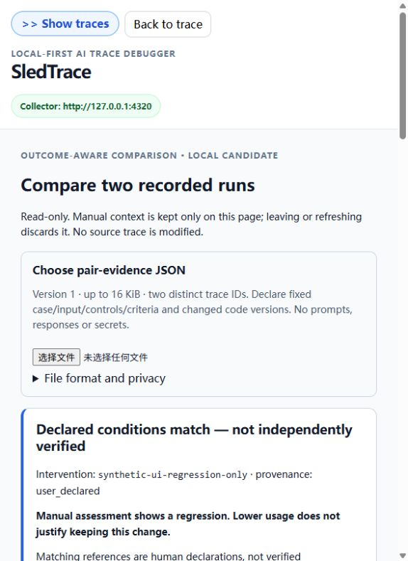
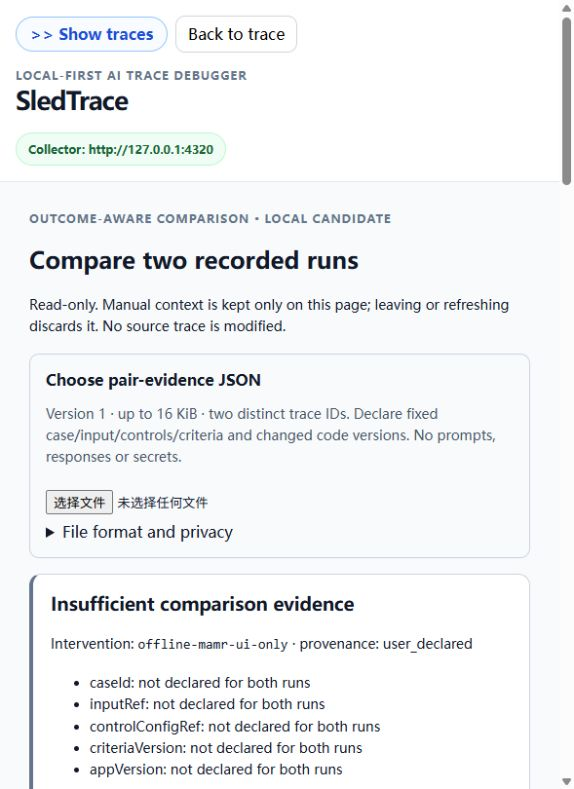

# Pair evidence v1 — local Dashboard candidate

Implemented locally in P5B after explicit user approval, not in the released
v0.7.1 wheel. The Dashboard reads two existing traces and a **user-declared**
comparison file. It never modifies either trace, uploads the declaration to the
Collector, stores it in browser persistence, or verifies/fetches its references.
Leaving the comparison view or refreshing discards it.

## Use

1. Run this checkout's Collector and Dashboard. Record/import both runs yourself.
2. Copy each trace ID from its detail page. Create a JSON file like the example
   below, replacing references with your actual fixed case/input/control/criteria
   identifiers and changed code versions. Use null where evidence is unavailable.
3. Click **Compare runs** in the top bar, then **Choose pair-evidence JSON**.
4. Review the conditions/gaps before interpreting metrics. Inspect either
   original trace/receipt with its button; returning requires selecting the file
   again. The view is intentionally not an experiment manager.

```json
{
  "schemaVersion": 1,
  "kind": "sledtrace-pair-evidence",
  "provenance": "user_declared",
  "interventionId": "turn-envelope-fix-v1",
  "baseline": {
    "traceId": "trace_before",
    "caseId": "case-1",
    "inputRef": "input-v1",
    "controlConfigRef": "controls-v1",
    "criteriaVersion": "quality-v1",
    "appVersion": "before",
    "qualityStatus": "not_evaluated",
    "qualityEvidenceRef": null
  },
  "candidate": {
    "traceId": "trace_after",
    "caseId": "case-1",
    "inputRef": "input-v1",
    "controlConfigRef": "controls-v1",
    "criteriaVersion": "quality-v1",
    "appVersion": "after",
    "qualityStatus": "not_evaluated",
    "qualityEvidenceRef": null
  }
}
```

This example does not create records and is not a validated real comparison.

## Exact contract

- Maximum 16 KiB (UTF-8 bytes); exact root/run fields above. Reject duplicate
  keys (including escaped aliases), extra/missing keys, wrong types, excessive
  nesting, unknown version/kind/provenance and self-pairs. Errors do not echo input.
- References use `[A-Za-z0-9][A-Za-z0-9._:/-]{0,199}`. traceId/interventionId
  are required nonempty identifiers. The five case/input/config/criteria/version
  references allow explicit null, not empty strings or inferred defaults.
- qualityStatus is passed/failed/not_evaluated. passed/failed requires non-null
  qualityEvidenceRef to a human-reviewed assessment; not_evaluated requires null.
  Assessment contents are not read or independently verified. The captured
  source outcome stays separate, even if accepted=true or a meeting was approved.
- controlConfigRef declares unchanged model/provider, prompts/data, limits,
  tools/recovery policy and other non-intervention conditions. Equality of labels
  or hashes is not verification. This first view concerns a single code change;
  it does not validate simultaneous model/config changes or statistical effects.
- Do not put prompts/responses, keys, customer content or complete configs in
  the file. Opaque identifiers may still be sensitive. Metadata-only validation
  is not a secret detector. No links/references are fetched or executed.

## Interpretation

Known mismatched case/input/config/criteria => not comparable. Any unknown
control or missing/identical code version => insufficient evidence. Otherwise
conditions are **declared matching, not independently verified**. Quality can
show a manual regression even when recorded usage is lower; no automatic repair,
semantic judge, or keep/revert recommendation.

Both sides show source outcomes/P4 gates, caller task acceptance when present,
manual declarations and recorded measurements. Step-status disclosure retains
failed/unresolved records; no temporal/parent relation is called a causal chain.
Legacy/RAG records receive no invented MAMR diagnosis.

Absolute differences require declared matching conditions. Token deltas additionally
require trustworthy totals for every observed LLM call, no conflict, and the same
known provenance/output/total basis. Visible-output and provider totals do not
mix. Partial subtotals remain visible with coverage, not full-run differences.
Zero observed LLM calls do not establish zero token usage or free execution.
Cost deltas require all observed calls priced under the same USD Standard-text
snapshot; current date label is 2026-09-24, not a live feed or provider bill.
Duration uses each trace's measured timing, not span sums or MAMR room updates.
Missing/offline/malformed details show explicit errors, never empty runs.
There are no percentages or whole-workflow savings claims.

## Validation evidence and limits

- Automated P5B cases cover exact parser/limits/duplicates, controls/quality,
  all recorded call statuses, null/zero, partial/conflicting/mixed provenance,
  price basis/coverage, unknown timing and malformed/legacy details.
- Actual local UI uses two clearly named synthetic records (2 vs 1 observed
  calls, 30 vs 5 recorded tokens). The candidate's simulated manual failed
  assessment produces regression despite lower usage; this is **not a real
  provider response or independently evaluated repair**. Synthetic pricing
  fields deliberately exercise the existing helper, not billing evidence.
- Existing MAMR offline rejection/completion records lack controls/quality;
  the view exposes gaps and disables deltas. Differing case declarations are
  non-comparable; missing record and wrong format show errors. An isolated
  temporary Dashboard with no Collector exercises offline handling.
- Keyboard step disclosure and original-trace navigation pass; leaving drops
  the declaration. Existing RAG 30/14-day conflict remains inspectable.
  Screenshots use the default browser viewport, with no content/viewport edits.





P5B establishes a local comparison mechanism, not M3b or product-value success.
P6 still needs a real fixed task, quality evidence and a bounded authorized
source change/experiment. Review [the roadmap](../product/ROAD_TO_V1_0.md) and
[the preflight rationale](../product/PAIR_COMPARISON_PREFLIGHT.md) before expanding.
